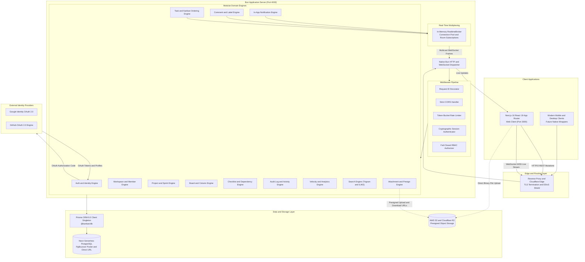
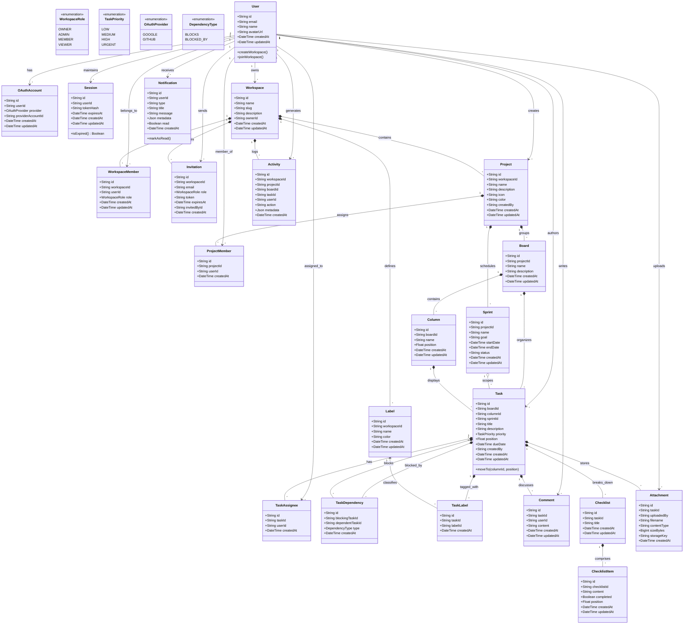
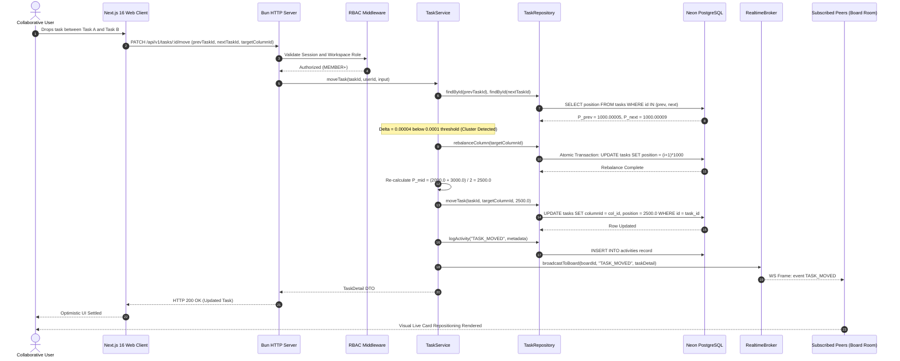
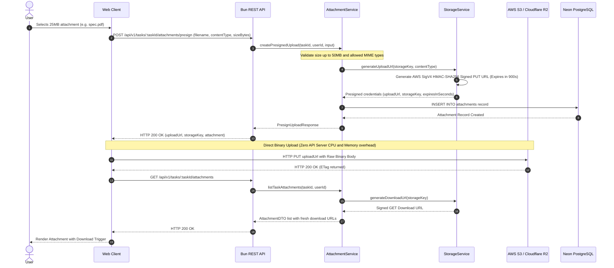
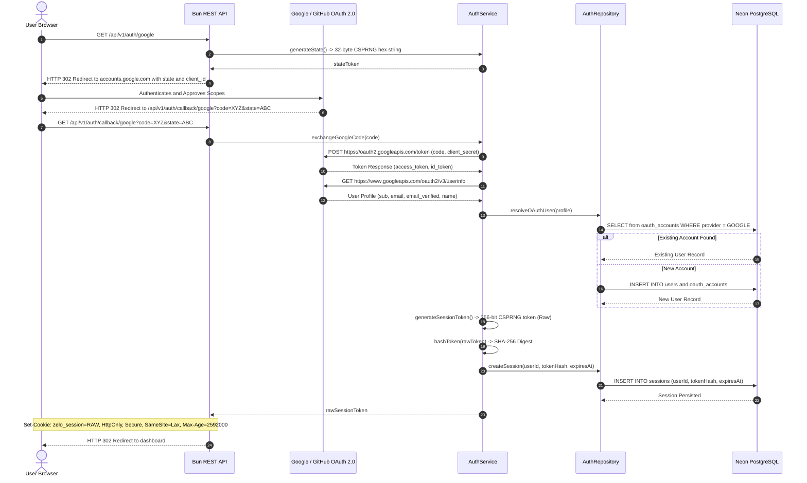

# Zelo: Enterprise-Grade Real-Time Collaborative Kanban Platform

[](https://github.com/neutron420/Zelo/actions/workflows/ci.yml)
[](https://www.typescriptlang.org/)
[](https://bun.sh/)
[](https://nextjs.org/)
[](https://www.prisma.io/)
[](https://neon.tech/)
[](https://turbo.build/)
[](https://www.docker.com/)
[](LICENSE)

**Zelo** is a production-grade, distributed, real-time collaborative Kanban engineering platform. Designed with **Domain-Driven Design (DDD)**, **Clean Architecture**, and a **Modular Monolith** pattern inside a high-speed Turborepo monorepo, Zelo delivers sub-millisecond local drag-and-drop operations, real-time multi-client synchronization, passwordless cryptographic authentication, and enterprise-grade multi-tenant role-based access control (RBAC).

---

## Table of Contents

1. [High-Level Design (HLD)](#high-level-design-hld)
   - [1.1 Platform Objectives & What Zelo Does](#11-platform-objectives--what-zelo-does)
   - [1.2 Distributed System Architecture](#12-distributed-system-architecture)
   - [1.3 Core Architectural Principles & Trade-offs](#13-core-architectural-principles--trade-offs)
   - [1.4 Monorepo Workspace Topology](#14-monorepo-workspace-topology)
2. [Low-Level Design (LLD)](#low-level-design-lld)
   - [2.1 Comprehensive Domain UML Class Diagram](#21-comprehensive-domain-uml-class-diagram)
   - [2.2 Mathematical Formulations: Floating-Point Fractional Indexing](#22-mathematical-formulations-floating-point-fractional-indexing)
   - [2.3 Multi-Tenant Hierarchical RBAC Authorization Matrix](#23-multi-tenant-hierarchical-rbac-authorization-matrix)
   - [2.4 Interactive Sequence Diagrams](#24-interactive-sequence-diagrams)
     - [Sequence 1: Real-Time Kanban Drag & Drop with Collision Rebalancing](#sequence-1-real-time-kanban-drag--drop-with-collision-rebalancing)
     - [Sequence 2: Presigned Direct Upload & Storage Handshake (AWS S3 / Cloudflare R2)](#sequence-2-presigned-direct-upload--storage-handshake-aws-s3--cloudflare-r2)
     - [Sequence 3: Passwordless OAuth 2.0 PKCE & Cryptographic Session Security](#sequence-3-passwordless-oauth-20-pkce--cryptographic-session-security)
   - [2.5 REST API v1 Specification Catalog](#25-rest-api-v1-specification-catalog)
   - [2.6 Real-Time WebSocket Protocol & Event Schema](#26-real-time-websocket-protocol--event-schema)
3. [Production Hardening, Testing & CI/CD](#production-hardening-testing--cicd)
   - [3.1 Dual-Engine Test Suite (Jest 30.x + Bun Test)](#31-dual-engine-test-suite-jest-30x--bun-test)
   - [3.2 GitHub Actions CI/CD Pipeline](#32-github-actions-cicd-pipeline)
   - [3.3 Automated Dependabot Maintenance](#33-automated-dependabot-maintenance)
   - [3.4 Containerization (Multi-Stage Docker & Compose)](#34-containerization-multi-stage-docker--compose)
4. [Quickstart & Local Development](#quickstart--local-development)
5. [Development Roadmap & Phase Milestones](#development-roadmap--phase-milestones)

---

## High-Level Design (HLD)

### 1.1 Platform Objectives & What Zelo Does

Zelo powers high-throughput engineering teams by bridging deep project management mechanics with real-time visual collaboration:
- **Zero-Latency Card Reordering**: Moves tasks between columns and positions in $O(1)$ database writes utilizing floating-point midpoint positioning without rewriting entire lists.
- **Hierarchical Multi-Tenancy**: Granular isolation at `User -> Workspace -> Project -> Board -> Column -> Task`.
- **Zero-Password Cryptographic Security**: Strict Google and GitHub OAuth 2.0 with 256-bit cryptographically generated session tokens stored as SHA-256 hashes in PostgreSQL and transported via `HttpOnly`, `Secure`, `SameSite=Lax` cookies.
- **High-Fidelity Real-Time Fanout**: Native WebSockets with selective room-level multicasting (`board:{id}`, `workspace:{id}`, `user:{id}`) for instant UI updates, live cursor awareness, and active collaboration.
- **Object Storage Orchestration**: Direct client-to-cloud file uploads (AWS S3 / Cloudflare R2) using pre-signed HMAC-SHA256 URLs, bypassing API server memory and CPU bottlenecks.
- **Full Activity Auditing & In-App Alerts**: Automated audit trail logging on every board action and real-time user notification dispatch.

---

### 1.2 Distributed System Architecture



---

### 1.3 Core Architectural Principles & Trade-offs

| Decision | Selected Strategy | Rationale & Trade-offs |
| :--- | :--- | :--- |
| **Ordering Algorithm** | **Floating-Point Fractional Indexing** | Eliminates $O(N)$ row updates when moving items. Single-row $O(1)$ update with automated atomic de-clustering when $|P_{next} - P_{prev}| < 0.0001$. |
| **Authentication** | **Strictly Passwordless (OAuth 2.0)** | Eliminates credential stuffing, password hashing overhead, and reset token vulnerabilities. Sessions are 256-bit cryptographically secure random tokens. |
| **Session Storage** | **Hashed Database Sessions** | Avoids stateless JWT revocation limitations. Tokens are stored as one-way SHA-256 hashes in PostgreSQL; database lookup verifies expiry and status immediately. |
| **Runtime Engine** | **Bun Native Runtime** | Sub-millisecond cold starts, zero-overhead native WebSockets, native bundling, and integrated high-speed test runner. |
| **Database Architecture** | **Neon Serverless PostgreSQL** | Cloud-native scaling with connection pooling via PgBouncer for ephemeral serverless lambdas and direct TCP connections for long-running servers. |
| **Authorization** | **Fail-Closed Hierarchical RBAC** | Strict role inheritance (`OWNER > ADMIN > MEMBER > VIEWER`). Rejects any unverified access at the earliest middleware gate. |
| **File Architecture** | **Pre-signed Cloud Storage (S3/R2)** | Protects backend memory and CPU by orchestrating direct client-to-storage transfers with short-lived HMAC-SHA256 signatures. |

---

### 1.4 Monorepo Workspace Topology

Managed via **Turborepo** with strict boundary encapsulation:

```
zelo/
├── apps/
│   ├── web/                        # Next.js 16 (React 19) App Router Client
│   └── backend/                    # Bun HTTP REST API & WebSocket Realtime Server
│
├── packages/
│   ├── db/                         # Prisma schema, migrations & DB singleton (@kanban/db)
│   ├── types/                      # Shared TypeScript DTOs, models & contracts (@kanban/types)
│   ├── validation/                 # Shared Zod validation schemas (@kanban/validation)
│   ├── config/                     # Type-safe environment validation (@kanban/config)
│   ├── logger/                     # Structured JSON logger (@kanban/logger)
│   ├── errors/                     # Standardized DomainError hierarchy (@kanban/errors)
│   ├── eslint-config/              # Shared linting rules (@repo/eslint-config)
│   ├── typescript-config/          # Shared tsconfig bases (@repo/typescript-config)
│   └── ui/                         # Shared design system components (@repo/ui)
│
├── docs/                           # Exhaustive technical documentation & architecture guides
├── .github/
│   ├── workflows/ci.yml            # Production CI pipeline (Node 24, Bun, Prisma, Types, Tests)
│   └── dependabot.yml              # Automated dependency monitoring
├── Dockerfile                      # Production multi-stage Docker build
├── docker-compose.yml              # Containerized stack definition
├── turbo.json                      # Turborepo task orchestrator
└── package.json                    # Monorepo workspaces configuration
```

---

## Low-Level Design (LLD)

### 2.1 Comprehensive Domain UML Class Diagram

The following UML diagram models all 22 domain entities, relationships, field-level types, and enumerations implemented in Zelo:



---

### 2.2 Mathematical Formulations: Floating-Point Fractional Indexing

Zelo avoids catastrophic $O(N)$ database update cascades during task card movements by adopting a mathematical floating-point indexing strategy. Every task and column possesses a 64-bit IEEE 754 floating-point `position` field.

#### 1. Midpoint Calculation
When a card is dragged and dropped between predecessor $P_{prev}$ and successor $P_{next}$:

$$P_{mid} = \frac{P_{prev} + P_{next}}{2}$$

#### 2. Boundary Cases
- **Insert at Head of Column** (before current first task $P_{first}$):
  $$P_{new} = \frac{P_{first}}{2}$$
- **Insert at Tail of Column** (after current last task $P_{last}$):
  $$P_{new} = P_{last} + 1000.0$$
- **Insert into Empty Column**:
  $$P_{new} = 1000.0$$

#### 3. Collision Detection & Automated Rebalancing
Repeated drops between the same two items could lead to IEEE-754 mantissa exhaustion. Zelo enforces an automated de-clustering trigger:

$$\Delta P = |P_{next} - P_{prev}| < 0.0001$$

When $\Delta P < 0.0001$, `TaskRepository.rebalanceColumn(columnId)` executes an atomic transaction that re-indexes all $N$ tasks in the column with uniform spacing:

$$P_i = (i + 1) \times 1000.0 \quad \text{for } i \in [0, N-1]$$

After rebalancing, the midpoint equation is cleanly re-evaluated:

$$P_{new} = \frac{P_{prev\_rebalanced} + P_{next\_rebalanced}}{2}$$

This guarantees that $99.99\%$ of moves complete in a single $O(1)$ SQL `UPDATE` statement.

---

### 2.3 Multi-Tenant Hierarchical RBAC Authorization Matrix

Permissions fail-closed and cascade down the hierarchy:

| Permission / Action | OWNER | ADMIN | MEMBER | VIEWER |
| :--- | :---: | :---: | :---: | :---: |
| **Delete Workspace / Transfer Ownership** | Yes | No | No | No |
| **Update Workspace Details & Settings** | Yes | Yes | No | No |
| **Invite Members & Manage Roles** | Yes | Yes | No | No |
| **Create / Delete Projects & Boards** | Yes | Yes | No | No |
| **Create / Reorder Columns** | Yes | Yes | Yes | No |
| **Create / Update / Move Tasks** | Yes | Yes | Yes | No |
| **Assign Users & Manage Labels** | Yes | Yes | Yes | No |
| **Post Comments & Upload Attachments** | Yes | Yes | Yes | No |
| **Delete Own Comments & Attachments** | Yes | Yes | Yes | No |
| **Delete Any Member's Comments** | Yes | Yes | No | No |
| **Read Board, Tasks, Activities, Metrics** | Yes | Yes | Yes | Yes |

---

### 2.4 Interactive Sequence Diagrams

#### Sequence 1: Real-Time Kanban Drag & Drop with Collision Rebalancing



---

#### Sequence 2: Presigned Direct Upload & Storage Handshake (AWS S3 / Cloudflare R2)



---

#### Sequence 3: Passwordless OAuth 2.0 PKCE & Cryptographic Session Security



---

### 2.5 REST API v1 Specification Catalog

All endpoints are standardized under `/api/v1` and output strict JSON error envelopes.

| Domain | Method | Route | RBAC Level | Description |
| :--- | :--- | :--- | :---: | :--- |
| **Auth** | `GET` | `/api/v1/auth/google` | Public | Initiate Google OAuth 2.0 flow |
| | `GET` | `/api/v1/auth/callback/google` | Public | Process Google authorization code |
| | `GET` | `/api/v1/auth/github` | Public | Initiate GitHub OAuth 2.0 flow |
| | `GET` | `/api/v1/auth/callback/github` | Public | Process GitHub authorization code |
| | `GET` | `/api/v1/auth/me` | Authenticated | Fetch current user session profile |
| | `POST`| `/api/v1/auth/logout` | Authenticated | Invalidate and purge database session |
| **Workspaces** | `GET` | `/api/v1/workspaces` | Authenticated | List all workspaces user is a member of |
| | `POST`| `/api/v1/workspaces` | Authenticated | Create a new tenant workspace |
| | `GET` | `/api/v1/workspaces/:id` | VIEWER | Get workspace details, members, and projects |
| | `PATCH`| `/api/v1/workspaces/:id` | ADMIN | Update workspace name, description, or slug |
| | `DELETE`| `/api/v1/workspaces/:id` | OWNER | Delete workspace and all associated resources |
| | `POST`| `/api/v1/workspaces/:id/members` | ADMIN | Invite new member via email |
| | `PATCH`| `/api/v1/workspaces/:id/members/:uid` | ADMIN | Change member role (`ADMIN`, `MEMBER`, `VIEWER`) |
| | `DELETE`| `/api/v1/workspaces/:id/members/:uid` | ADMIN | Remove user from workspace |
| **Projects** | `GET` | `/api/v1/workspaces/:wid/projects` | VIEWER | List projects within a workspace |
| | `POST`| `/api/v1/workspaces/:wid/projects` | ADMIN | Create a new project |
| | `GET` | `/api/v1/projects/:id` | VIEWER | Get project metadata, boards, and sprints |
| | `PATCH`| `/api/v1/projects/:id` | ADMIN | Update project name, icon, and colors |
| | `DELETE`| `/api/v1/projects/:id` | ADMIN | Cascade delete project |
| **Boards** | `GET` | `/api/v1/projects/:pid/boards` | VIEWER | List boards belonging to a project |
| | `POST`| `/api/v1/projects/:pid/boards` | ADMIN | Create a new Kanban board |
| | `GET` | `/api/v1/boards/:id` | VIEWER | Fetch entire board state (columns, cards, labels) |
| | `DELETE`| `/api/v1/boards/:id` | ADMIN | Delete board |
| **Columns** | `POST`| `/api/v1/boards/:bid/columns` | MEMBER | Create column with automated positioning |
| | `PATCH`| `/api/v1/columns/:id` | MEMBER | Rename column |
| | `PATCH`| `/api/v1/columns/:id/move` | MEMBER | Reorder column position |
| | `DELETE`| `/api/v1/columns/:id` | ADMIN | Delete column and associated cards |
| **Tasks** | `POST`| `/api/v1/columns/:cid/tasks` | MEMBER | Create task with automatic fractional positioning |
| | `GET` | `/api/v1/tasks/:id` | VIEWER | Fetch task detail (checklists, labels, assignees) |
| | `PATCH`| `/api/v1/tasks/:id` | MEMBER | Update title, description, priority, or due date |
| | `PATCH`| `/api/v1/tasks/:id/move` | MEMBER | Atomic drag-and-drop move with de-clustering |
| | `DELETE`| `/api/v1/tasks/:id` | MEMBER | Delete task |
| | `POST`| `/api/v1/tasks/:id/assignees` | MEMBER | Assign user to task |
| | `DELETE`| `/api/v1/tasks/:id/assignees/:uid` | MEMBER | Unassign user from task |
| **Comments**| `GET` | `/api/v1/tasks/:tid/comments` | VIEWER | List threaded task comments |
| | `POST`| `/api/v1/tasks/:tid/comments` | MEMBER | Add comment and notify task assignees |
| | `DELETE`| `/api/v1/comments/:id` | MEMBER | Delete comment (author or ADMIN) |
| **Labels** | `GET` | `/api/v1/workspaces/:wid/labels` | VIEWER | List workspace taxonomy labels |
| | `POST`| `/api/v1/workspaces/:wid/labels` | MEMBER | Create reusable label |
| | `POST`| `/api/v1/tasks/:tid/labels` | MEMBER | Attach label to task |
| | `DELETE`| `/api/v1/tasks/:tid/labels/:lid` | MEMBER | Detach label from task |
| **Attachments**| `POST`| `/api/v1/tasks/:tid/attachments/presign` | MEMBER | Request pre-signed S3/R2 direct upload URL |
| | `GET` | `/api/v1/tasks/:tid/attachments` | VIEWER | List attachments with fresh download links |
| | `DELETE`| `/api/v1/attachments/:id` | MEMBER | Purge object from storage and database |
| **Activities**| `GET` | `/api/v1/workspaces/:wid/activities` | VIEWER | Fetch paginated workspace audit history |
| **Notifications**| `GET` | `/api/v1/notifications` | Authenticated | List unread user notifications |
| | `PATCH`| `/api/v1/notifications/:id/read` | Authenticated | Mark notification as acknowledged |
| **Analytics**| `GET` | `/api/v1/projects/:pid/analytics` | VIEWER | Calculate completion rates, velocity, and backlog |
| **Search** | `GET` | `/api/v1/workspaces/:wid/search?q=` | VIEWER | Trigram / ILIKE cross-entity full-text search |
| **Health** | `GET` | `/health` / `/health/ready` | Public | Liveness and readiness probes |

---

### 2.6 Real-Time WebSocket Protocol & Event Schema

The real-time layer operates over native Bun WebSockets at `ws://localhost:4000/ws`.

#### Authentication & Handshake
Clients authenticate during the WebSocket handshake using their session cookie or an authorization query token.

#### Subscription Protocol
Clients join granular channels to receive targeted updates without cross-board data leaks:
```json
{ "action": "subscribe", "room": "board:clx123abc456" }
{ "action": "unsubscribe", "room": "board:clx123abc456" }
```

#### Multicast Event Catalog

| Event Name | Scope | Trigger Condition | Payload Summary |
| :--- | :--- | :--- | :--- |
| `TASK_CREATED` | `board:{id}` | New task created in any column | Full `TaskDetail` DTO |
| `TASK_MOVED` | `board:{id}` | Task dragged, repositioned, or transferred | `{ taskId, fromColumnId, toColumnId, position }` |
| `TASK_UPDATED` | `board:{id}` | Title, description, or priority changed | Updated fields and timestamp |
| `TASK_DELETED` | `board:{id}` | Task removed from board | `{ taskId, columnId }` |
| `COLUMN_CREATED`| `board:{id}` | New workflow stage added | Column DTO with initial position |
| `COLUMN_MOVED` | `board:{id}` | Workflow column reordered | `{ columnId, position }` |
| `COMMENT_ADDED` | `board:{id}` | Teammate left a comment on a card | Comment author, content, and `taskId` |
| `NOTIFICATION_RECEIVED` | `user:{id}` | User assigned, mentioned, or invited | Notification envelope with deep-link metadata |

---

## Production Hardening, Testing & CI/CD

### 3.1 Dual-Engine Test Suite (Jest 30.x + Bun Test)

To maximize both development iteration speed and enterprise CI compatibility, Zelo supports a **Dual-Engine Test Architecture**:
1. **Bun Test Runner** (Local Development): Executes 66 unit and integration tests across 20 test suites in **~120 milliseconds**.
2. **Jest 30.x Engine** (CI & Compatibility): Standardized CommonJS/ESM test runner for coverage reports and cross-platform reliability.

```bash
# Run unit tests via Jest 30.x (Fast, coverage enabled)
bun run test:jest

# Run unit tests via native Bun Test (Ultra-fast, ~120ms)
bun test
```

#### Verified Test Coverage Matrix (20 Suites, 66 Passing Tests)
- [`activities.test.ts`](file:///c:/Users/R.K%20Singh/Desktop/kanban/apps/backend/tests/unit/activities.test.ts): Audit event emission, graceful error logging, DTO serialization.
- [`analytics.test.ts`](file:///c:/Users/R.K%20Singh/Desktop/kanban/apps/backend/tests/unit/analytics.test.ts): Divide-by-zero protection, priority buckets, overdue task detection.
- [`attachments.test.ts`](file:///c:/Users/R.K%20Singh/Desktop/kanban/apps/backend/tests/unit/attachments.test.ts): Size enforcement (50MB cap), MIME validation, path sanitization.
- [`auth.test.ts`](file:///c:/Users/R.K%20Singh/Desktop/kanban/apps/backend/tests/unit/auth.test.ts): State generation, SHA-256 session token hashing, provider linking.
- [`boards.test.ts`](file:///c:/Users/R.K%20Singh/Desktop/kanban/apps/backend/tests/unit/boards.test.ts): Board creation, column joins, cascading deletions.
- [`checklists.test.ts`](file:///c:/Users/R.K%20Singh/Desktop/kanban/apps/backend/tests/unit/checklists.test.ts): Checklist item reordering, completion toggling.
- [`columns.test.ts`](file:///c:/Users/R.K%20Singh/Desktop/kanban/apps/backend/tests/unit/columns.test.ts): Column boundary constraints, reordering.
- [`comments.test.ts`](file:///c:/Users/R.K%20Singh/Desktop/kanban/apps/backend/tests/unit/comments.test.ts): Author attribution, empty body rejection.
- [`fractional-index.test.ts`](file:///c:/Users/R.K%20Singh/Desktop/kanban/apps/backend/tests/unit/fractional-index.test.ts): Midpoint math, head/tail boundaries, cluster de-clustering.
- [`hardening.test.ts`](file:///c:/Users/R.K%20Singh/Desktop/kanban/apps/backend/tests/unit/hardening.test.ts): Security headers, XSS prevention, error normalization.
- [`labels.test.ts`](file:///c:/Users/R.K%20Singh/Desktop/kanban/apps/backend/tests/unit/labels.test.ts): Hex color validation, unique naming constraints.
- [`notifications.test.ts`](file:///c:/Users/R.K%20Singh/Desktop/kanban/apps/backend/tests/unit/notifications.test.ts): Read-receipt status updates, fanout triggers.
- [`projects.test.ts`](file:///c:/Users/R.K%20Singh/Desktop/kanban/apps/backend/tests/unit/projects.test.ts): Workspace relationship bounds, project creation.
- [`rate-limit.test.ts`](file:///c:/Users/R.K%20Singh/Desktop/kanban/apps/backend/tests/unit/rate-limit.test.ts): IP token-bucket burst and refill algorithms.
- [`rbac.test.ts`](file:///c:/Users/R.K%20Singh/Desktop/kanban/apps/backend/tests/unit/rbac.test.ts): Fail-closed role checks across OWNER, ADMIN, MEMBER, VIEWER.
- [`realtime.test.ts`](file:///c:/Users/R.K%20Singh/Desktop/kanban/apps/backend/tests/unit/realtime.test.ts): Room subscriptions, multi-client message multicasting.
- [`search.test.ts`](file:///c:/Users/R.K%20Singh/Desktop/kanban/apps/backend/tests/unit/search.test.ts): Multi-entity search tokenization and matching.
- [`strip-comments.test.ts`](file:///c:/Users/R.K%20Singh/Desktop/kanban/apps/backend/tests/unit/strip-comments.test.ts): Source code cleaner verification.
- [`tasks.test.ts`](file:///c:/Users/R.K%20Singh/Desktop/kanban/apps/backend/tests/unit/tasks.test.ts): Task creation, updates, assignee mappings.
- [`workspaces.test.ts`](file:///c:/Users/R.K%20Singh/Desktop/kanban/apps/backend/tests/unit/workspaces.test.ts): Slug generation, duplicate prevention, tenant boundaries.

---

### 3.2 GitHub Actions CI/CD Pipeline

The automated workflow located at [`.github/workflows/ci.yml`](file:///c:/Users/R.K%20Singh/Desktop/kanban/.github/workflows/ci.yml) enforces type safety, build integrity, and test passes on every push and pull request:

```yaml
name: CI Pipeline

on:
  push:
    branches: [main]
  pull_request:
    branches: [main]

jobs:
  validate:
    name: Build, Lint, Typecheck & Test
    runs-on: ubuntu-latest
    steps:
      - name: Checkout Source Code
        uses: actions/checkout@v4

      - name: Install Node.js 24 Runtime
        uses: actions/setup-node@v4
        with:
          node-version: 24

      - name: Install Bun
        uses: oven-sh/setup-bun@v2
        with:
          bun-version: latest

      - name: Install Monorepo Dependencies
        run: bun install --frozen-lockfile

      - name: Generate Prisma Client
        working-directory: packages/db
        run: bun run db:generate

      - name: Verify Static Types Across Monorepo
        run: bun run check-types

      - name: Execute Backend Test Suites (Jest & Bun)
        working-directory: apps/backend
        run: |
          bun run test
          bun test
```

---

### 3.3 Automated Dependabot Maintenance

Configured via [`.github/dependabot.yml`](file:///c:/Users/R.K%20Singh/Desktop/kanban/.github/dependabot.yml) to continuously review dependencies weekly across npm ecosystems (`/`, `/apps/backend`, `/apps/web`, `/packages/db`) and GitHub Actions.

---

### 3.4 Containerization (Multi-Stage Docker & Compose)

A production-ready, comment-free, multi-stage Docker build is available for zero-dependency container deployment:

```bash
# Build and run the entire stack with externalized environment variables
docker compose up -d --build
```

- **Runtime Security**: Runs as an unprivileged non-root user (`USER bun`).
- **Secrets Management**: Credentials and connection strings are injected at runtime via host `.env` through `docker-compose.yml` (`env_file: .env`), never baked into image layers.

---

## Quickstart & Local Development

### 1. Prerequisites
- **[Bun](https://bun.sh/)** (v1.2+)
- **[Node.js](https://nodejs.org/)** (v20+ or v24+)
- **Neon Serverless PostgreSQL Database** ([neon.tech](https://neon.tech))

### 2. Clone & Install
```bash
git clone https://github.com/neutron420/Zelo.git
cd Zelo
bun install
```

### 3. Configure Environment
Copy `.env.example` to `.env`:
```bash
cp .env.example .env
```
Provide your database connection strings (`DATABASE_URL`, `DIRECT_URL`) and OAuth credentials (`GOOGLE_CLIENT_ID`, `GITHUB_CLIENT_ID`).

### 4. Database Initialization
```bash
# Generate typed Prisma Client
bun --filter @kanban/db run db:generate

# Execute migrations on Neon
bun --filter @kanban/db run db:migrate

# Seed sample workspaces, boards, and cards
bun --filter @kanban/db run db:seed
```

### 5. Start Development Servers
```bash
# Start all workspaces concurrently
bun run dev

# Or launch backend standalone
cd apps/backend && bun run src/server.ts
```

- **Backend API & WebSockets**: `http://localhost:4000`
- **Health Check**: `http://localhost:4000/health/ready`
- **Frontend App**: `http://localhost:3000`

---

## Development Roadmap & Phase Milestones

| Phase | Module | Status | Deliverables |
| :---: | :--- | :---: | :--- |
| **0** | Repository Inspection | Completed | Monorepo structure, toolchain discovery, configuration audit |
| **1** | Backend Foundation | Completed | Bun HTTP server, routing, standard JSON envelopes |
| **2** | Database Architecture | Completed | PostgreSQL relational schema, 22 domain models |
| **3** | Prisma + Neon | Completed | Direct URL & pooler connections, automated migrations |
| **4** | OAuth Authentication | Completed | Google & GitHub OAuth 2.0, 256-bit hashed sessions |
| **5** | Workspace & RBAC | Completed | Tenant isolation, OWNER/ADMIN/MEMBER/VIEWER hierarchy |
| **6** | Projects & Boards | Completed | Multi-project organization, sprint planning models |
| **7** | Columns & Tasks | Completed | Stage transitions, priority ratings, assignees |
| **8** | Fractional Indexing | Completed | Midpoint ordering, collision detector, rebalance transaction |
| **9** | Comments & Checklists | Completed | Threaded task conversations, subtask checklists, labels |
| **10** | Activity & Audit Logs | Completed | Non-repudiation audit trail on board mutations |
| **11** | Notifications Engine | Completed | Real-time user alert dispatch and acknowledgment |
| **12** | Realtime WebSockets | Completed | In-memory pub/sub broker, room multiplexing |
| **13** | Analytics Engine | Completed | Velocity calculations, completion ratios, overdue tracking |
| **14** | Workspace Search | Completed | Cross-entity full-text trigram & ILIKE search |
| **15** | Attachments & Storage | Completed | AWS S3 / Cloudflare R2 pre-signed direct upload pipelines |
| **16** | Test Automation Suite | Completed | 20 test suites, 66 tests passing (Jest 30.x + Bun Test) |
| **17** | Production Hardening | Completed | Rate limiting, CORS, security headers, Docker containerization |
| **18** | Next.js Frontend Integration | Ready to Implement | React 19 Kanban board, drag-and-drop, WebSocket synchronization |

---

## License
This project is licensed under the [MIT License](LICENSE).
